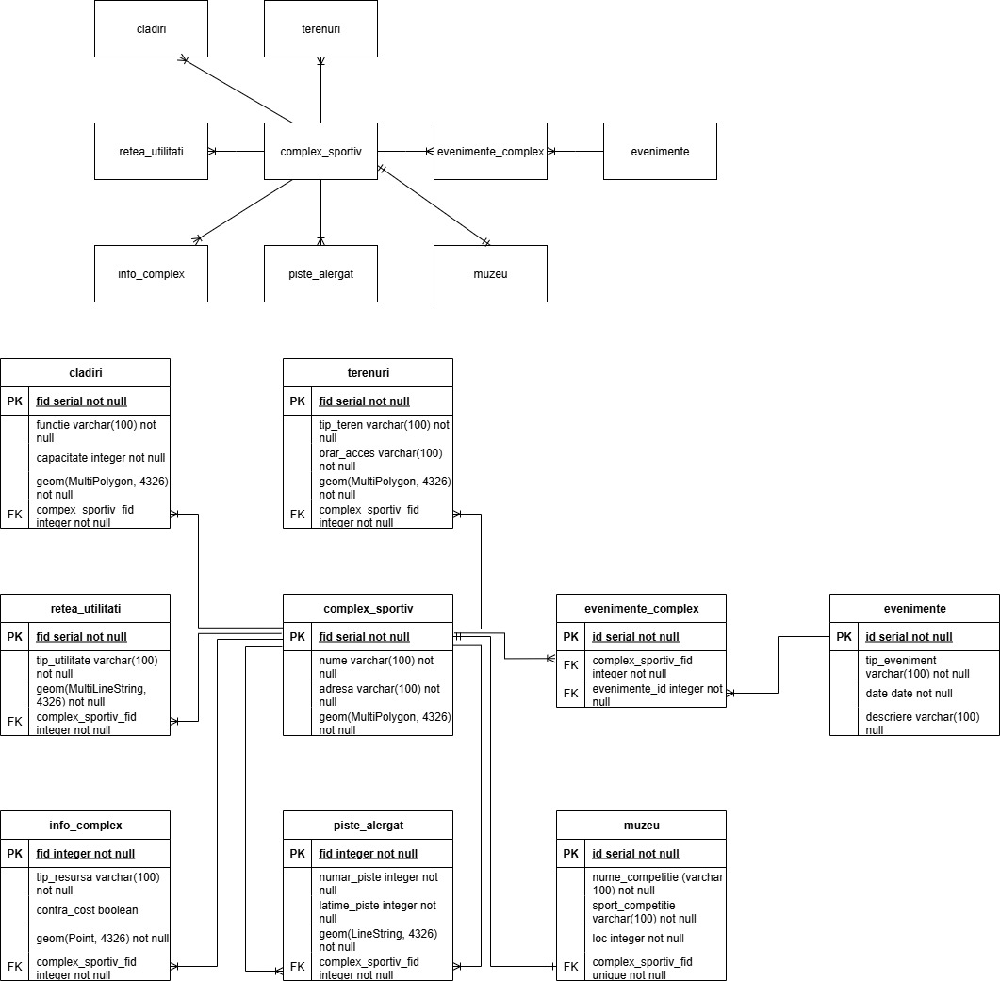

** Descrierea proiectului **

Un complex sportiv funcționează eficient prin organizarea unor componente esențiale, precum clădirile, fiecare având un rol bine definit – săli de antrenament, vestiare sau spații administrative. Terenurile sunt special amenajate pentru diverse sporturi, iar pistele de alergare oferă spații pentru activitate fizică în aer liber. O rețea de utilități asigură alimentarea cu resurse necesare, iar sistemul de informare include tipuri de acces precum bilete, abonamente, panouri informative sau alte servicii, unele disponibile contra cost. Complexul integrează și un muzeu sportiv cu rol educativ și cultural. Evenimentele organizate periodic sunt gestionate printr-un sistem relațional care le asociază direct cu locațiile din complex.

Entități:complex_sportiv, cladiri, terenuri, piste_alergat, retea_utilitati, info_complex, muzeu, evenimente, evenimente_complex

